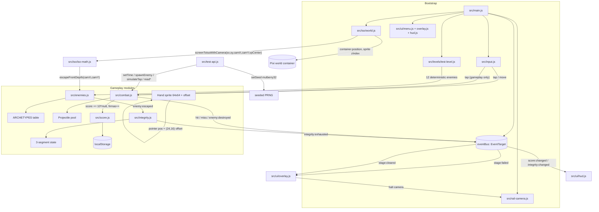

# Design: F3 — Shooter Rail Gameplay

> **Change**: `fase-3-shooter-rail-gameplay` · **Project**: zarra-defenders-2d · **Base**: main @ `d93ff08` (F2.5.15 archived) · **Mode**: hybrid · **Strategy**: single-pr with `size:exception` (user-approved 2026-09-07)
> **Source of truth**: `proposal.md` + 12 delta specs (combat-core, enemy-archetypes, player-integrity, game-test-api, main-menu, game-over-flow, victory-flow, best-score, hand-pen-sprite, iso-tile-system MODIFIED, iso-camera-integration MODIFIED, iso-asset-pipeline MODIFIED)

## 1. Architecture overview



**Layer separation** (preserved from F2.5.15):
- `app.stage → world (camera-driven) │ hud (screen-space, no iso transform) │ ui (DOM overlays)`. Combat projectiles live in `hud` so the sine-wave offset does not inherit iso jitter. The hand sprite lives in `hud` with `zIndex = 1000` so it always sits on top of the crosshair.
- Main menu, Acerca de, Disclaimer, game-over overlay, victory overlay are **HTML `<button>` elements in the DOM** (z-index above the Pixi canvas), NOT Pixi containers. The Pixi canvas remains behind, paused while overlays are visible (`app.ticker.stop()` / `start()`).

## 2. Module breakdown

### 2.1 `src/combat.js` (NEW)

Owns: projectile pool, cooldown gate, hit-resolution pipeline.

```js
export class Combat {
  constructor({ scene, isoWorld, eventBus, rng, opts })
  // opts: { cooldownMs = 333, projectileSpeed = 800, lifetimeMs = 1500,
  //         sineAmplitudePx = 2, sinePeriodMs = 400, frustumMarginTiles = 1 }
  fireAtIso(isoX, isoY, originScreen /* {x,y} from hand center */): { hit: boolean, enemyId: string | null }
  update(dtMs): void                                   // ticks projectiles
  reset(): void                                        // wipes pool, used by Reintentar
  on(event, cb) / off(event, cb): void                 // passthrough to eventBus
  // Consumed topics: none (input wires directly via fireAtIso)
  // Emitted topics: combat:fire, combat:hit, combat:miss, enemy:destroyed (via enemies.js)
}
```

State owned: `Array<Projectile>` (pool), `lastFireMs` (cooldown timestamp), `currentSeed`. Projectiles are `PIXI.Graphics` lines (4 px stroke + 1 px outline) + the papeleta sprite stamped at the tip; despawn at first of (lifetime, hit, frustum exit).

### 2.2 `src/enemies.js` (NEW)

```js
export const ARCHETYPES = Object.freeze({
  standard:    { hp: 1,  multiplier: 1,   footprint: { hw: 0.5, hh: 0.5 }, flashMs: 200, spriteId: 'enemies_camion_treco' },
  tank:        { hp: 3,  multiplier: 1.5, footprint: { hw: 0.7, hh: 0.7 }, flashMs: 200, spriteId: 'enemies_dron_fumigador' },
  'mini-boss': { hp: 10, multiplier: 2,   footprint: { hw: 0.8, hh: 0.8 }, flashMs: 200, spriteId: 'enemies_topadora' },
  boss:        { hp: 30, multiplier: 3,   footprint: { hw: 1.0, hh: 1.0 }, flashMs: 200, spriteId: 'enemies_incineradora' },
})

export class Enemy {
  constructor({ id, archetype, isoX, isoY, sprite })
  applyHit(damage: 1): { hpRemaining, destroyed }
  markDestroyed(): void
  isExpired(now): boolean
}

export class EnemyManager {
  constructor({ scene, eventBus, rng })
  spawn(def /* {id, archetype, isoX, isoY, spriteId, spawnTimeSec} */): Enemy
  remove(enemyId): void
  update(dtMs, cameraIso): void
  readAll(): Enemy[]                          // for __gameTestAPI__
  reset(): void                               // wipe + respawn from fixture
  // Emitted: enemy:escaped, enemy:destroyed
}
```

The `archetype → spriteId` mapping is the single binding surface. `EnemyManager.update(dt, cameraIso)` evaluates escape via `if (enemy.isoX + enemy.isoY > escapeFrontDepth(cameraIso)) emit('enemy:escaped') + emit('integrity:changed')` — the integrity side-effect is in `Integrity` (decoupled via the event bus).

### 2.3 `src/integrity.js` (NEW)

```js
export class Integrity {
  constructor({ eventBus, max = 3 })
  reset(): void
  drain(reason /* 'enemy:escaped' */): { current, max, exhausted: boolean }
  get current(): number
  get max(): number
  // Emitted: integrity:changed { current, max }, integrity:exhausted { current, max, score, firmas }
  // Listens to: enemy:escaped (calls drain), stage:cleared (freezes), stage:failed (freezes)
}
```

State owned: `{ current, max }`. The class is the **single source of truth** for integrity. `drain()` floors at 0 and emits `integrity:exhausted` exactly once on the `>0 → 0` transition.

### 2.4 `src/score.js` (NEW)

```js
export const BEST_KEY = 'zarra2d:best:test_level'
export class Score {
  constructor({ eventBus })
  addHit(archetypeMultiplier): { scoreDelta, firmasDelta }
  reset(): void
  read(): { score, firmas, bestFirmas, bestScore }
  tryWriteBest(): void                                       // called on victory only
  loadBest(): { score, firmas, date } | null                  // called on main menu mount
  // Emitted: score:changed { score, firmas, best }
  // Listens to: combat:hit (adds), stage:cleared (tryWriteBest)
}
```

Persistence: every `localStorage` call wrapped in try/catch; on throw, in-memory best stays at `null` and `loadBest()` returns `null`. One attempt per read/write (no retry loop).

### 2.5 `src/ui/menu.js` (NEW)

```js
export class MainMenu {
  constructor({ eventBus, score })
  mount(): void              // populate "Mejor: N firmas" text from score.loadBest()
  show(): void               // display: flex, focus "Iniciar test level"
  hide(): void               // display: none
  // Emitted: menu:startRequested, menu:aboutRequested, menu:disclaimerRequested
  // Listens to: keyboard (Up/Down/Enter/Escape) gated on visibility
}
```

Acercar de + Disclaimer are sibling `<div>` modals (also in the DOM, not Pixi) — both `pointer-events: auto`, z-index above menu.

### 2.6 `src/ui/overlay.js` (NEW)

```js
export class Overlay {
  constructor({ eventBus, integrity, score, camera, combat, enemies })
  showGameOver(): void       // halts camera, dims world (CSS opacity 0.5), shows modal
  showVictory(): void        // same as gameOver with positive copy + best-score write
  hide(): void
  // Emitted: ui:overlayShown, ui:overlayHidden
  // Listens to: integrity:exhausted (showGameOver), victory (showVictory),
  //             buttonReintentar (reset everything + hide), buttonVolver (emit menu:back + hide)
}
```

Halting the camera uses a new `RailCamera.setTime(t)` + a `_halted` flag the ticker honors (see §3.1).

### 2.7 `src/ui/hud.js` (NEW)

```js
export class HUD {
  constructor({ hudContainer, integrity, score, hand, camera, viewportWidth, viewportHeight })
  update(): void                                              // repositions hand, redraws segments + counters
  // Listens to: integrity:changed (segment redraw), score:changed (text update),
  //             input.move (hand reposition), state change (visible / hidden)
}
```

Segment rendering: `PIXI.Graphics` 3 rectangles (64×24 px each, 4 px gap), green `#3FB950` filled / dark gray `#3A3A3A` empty. CSS media query for viewports < 600 px → 160×20 px fallback. Hand sprite lives in the same `hud` container, `zIndex = 1000`.

### 2.8 `src/levels/test-level.js` (NEW)

```js
export const TEST_LEVEL = Object.freeze({
  railPath: [
    { t: 0,  isoX: 0,  isoY: 0  },
    { t: 60, isoX: 18, isoY: 18 },
  ],
  railEndTime: 60,            // victory trigger fires when camera.getTime() >= 60 AND enemies empty
  enemies: [                  // 12 deterministic enemies — composition locked at 8 standard, 2 tank, 1 mini-boss, 1 boss
    { id: 'e01', archetype: 'standard', isoX:  3, isoY:  2, spriteId: 'enemies_camion_treco' },
    { id: 'e02', archetype: 'standard', isoX:  5, isoY:  3, spriteId: 'enemies_bolsa_plastico' },
    { id: 'e03', archetype: 'standard', isoX:  7, isoY:  4, spriteId: 'enemies_bidon_lixiviado' },
    { id: 'e04', archetype: 'standard', isoX:  9, isoY:  5, spriteId: 'enemies_tubo_lixiviado' },
    { id: 'e05', archetype: 'tank',     isoX: 11, isoY:  6, spriteId: 'enemies_dron_fumigador' },
    { id: 'e06', archetype: 'standard', isoX: 12, isoY:  7, spriteId: 'enemies_valla_publicitaria' },
    { id: 'e07', archetype: 'standard', isoX: 13, isoY:  8, spriteId: 'enemies_camion_treco' },
    { id: 'e08', archetype: 'standard', isoX: 14, isoY:  9, spriteId: 'enemies_topadora' },
    { id: 'e09', archetype: 'tank',     isoX: 15, isoY: 10, spriteId: 'enemies_camion_cisterna_residuos' },  // placeholder PNG
    { id: 'e10', archetype: 'standard', isoX: 16, isoY: 11, spriteId: 'enemies_trailer' },
    { id: 'e11', archetype: 'mini-boss',isoX: 17, isoY: 12, spriteId: 'enemies_planta_treco' },
    { id: 'e12', archetype: 'boss',     isoX: 18, isoY: 13, spriteId: 'enemies_sello_burocratico' },
  ],
})
```

All positions / archetypes are baked constants — no `Math.random`. `EnemyManager` reads the array on boot.

### 2.9 `src/test-api.js` (NEW — extends `window.__gameTestAPI__`)

```js
export function mountTestAPI({ bus, camera, combat, enemies, integrity, score, rng })
// Methods (locked surface per game-test-api spec): getStatus, getSeed, setSeed,
// setTime, tick, fireAtIso, simulateTap, getEnemies, getIntegrity, getScore,
// getProjectiles, on, off.
```

Under `?test=1`: PRNG = `mulberry32(0xC0FFEE)`; production uses `Math.random()`. `__gameTestAPI__.simulateTap(x,y)` dispatches a synthetic `pointerdown` through `Input` (cooldown-respecting); `fireAtIso(x,y)` calls `Combat.fireAtIso` directly (bypasses cooldown for tests).

## 3. Modified files

### 3.1 `src/rail-camera.js` (LOCKED FILE — additive only, scoped exception)

Add (NOT a breaking change):

```js
class RailCamera {
  setTime(t /* seconds */)        // seeks; honors ?test=1 override
  getTime()                        // returns elapsed
  halt() / unHalt()                // freezes the ticker (Overlay calls halt())
  isHalted()                       // ticker checks before advancing
}
```

`update(dt)` becomes a no-op when `isHalted()`. `setTime(0)` resets state for Reintentar.

### 3.2 `src/iso/world.js`

Add `screenToIsoWithCamera(sx, sy, cameraIsoX, cameraIsoY, viewportCenter)` — a pure helper that subtracts `viewOrigin − camScreen` from `(sx, sy)` before delegating to `screenToIso`. Mark existing `screenToIso` as `@deprecated`. Export `escapeFrontDepth = (camIsoX, camIsoY) => camIsoX + camIsoY + 1` (lives in `iso-math.js` but re-exported here per TILE-005).

### 3.3 `src/iso/iso-math.js`

Add `ISO_STEP = (tileSize) => tileSize / Math.SQRT2` (named export) and `MAX_VISIBLE_TILES = 400` (re-export from `tilemap.js`). Existing math untouched — drift was spec-side.

### 3.4 `src/iso/tilemap.js`

Lift `MAX_VISIBLE_TILES` from `100` to `400`. Export it as a named constant.

### 3.5 `src/input.js` (LOCKED — additive only)

Add `Input.setGate(predicate)` — when the predicate returns `false`, `tap` events are silently dropped before reaching `Player`. Main menu activates the gate during `main-menu` / `overlay` states.

### 3.6 `src/player.js` (LOCKED — additive only)

Replace cyan crosshair render: keep the `PIXI.Graphics` crosshair, but its position is owned by `HUD` now (Player emits pointer events into the event bus; HUD reads them). Pause behaviour preserved.

### 3.7 `src/main.js`

Replaces the existing `app.ticker.add(...)` block with the orchestrator below (§5). Adds:
- Boot order: orientation lock → menu mount → manifest load → tilemap load → sprites load → enemies spawn → ticker start.
- `?test=1` branch: skip menu, mount test level, mount seeded PRNG.
- `__gameTestAPI__` wiring (replaces the existing stub).
- DOM overlay creation: `<div id="main-menu">`, `<div id="overlay">`, `<div id="hud-bar">`.
- Pointer-event gating: menu/overlay visible → `canvas { pointer-events: none }`.

### 3.8 `index.html`

Add 3 DOM containers (`#main-menu`, `#game-overlay`, `#integrity-hud`) as siblings of `#game-canvas-wrapper`. Load `src/ui/menu.js`, `src/ui/overlay.js`, `src/ui/hud.js` via additional `<script type="module">` tags.

### 3.9 `styles/main.css`

Add: `#main-menu`, `#game-overlay`, `#integrity-hud`, button focus halos, modal layout, responsive breakpoints (≤600 px), `.hidden` rule (already exists — reuse).

### 3.10 `assets/sprites/manifest.json` (NEW — file does not exist)

Tiny new file (not modifying any existing manifest):

```json
{
  "active": {
    "camion_cisterna_residuos": { "path": "assets/sprites/camion_cisterna_residuos.png", "archetype": "tank", "placeholder": true },
    "dron_fumigador":            { "path": "assets/sprites/enemies_dron_fumigador.png", "archetype": "tank" },
    "hand_pen":                  { "path": "assets/sprites/hand_pen.png", "real": true }
  },
  "deprecated": {
    "plataforma_solar": { "path": "assets/sprites/enemies_plataforma_solar.png", "note": "F4 audit trail" }
  }
}
```

### 3.11 `assets/levels/test-level.json` (NEW — JSON mirror of TEST_LEVEL constant)

The `test-level.js` constant is the runtime source; the JSON is committed for tooling + visual inspection (`tests/zarra-demo.html` adds a "test fixture" panel listing the 12 enemies).

### 3.12 `assets/sprites/camion_cisterna_residuos.png` (NEW — hand-authored placeholder)

64×64 magenta-chroma PNG (per ASSET-004 spec — NOT minimax-generated). F4 owns the regen.

### 3.13 `tests/iso-smoke.js` (MODIFIED for drift cleanup)

Bump mock cull-cap expectation `≤ 100` → `≤ 400`. Mock canvas size already 64×64 (F2.5.2).

## 4. Event bus topics

| Topic | Direction | Payload | Emitter | Consumer |
|---|---|---|---|---|
| `combat:fire` | emit | `{ isoX, isoY, sourceScreen }` | Combat | (debug) |
| `combat:hit` | emit | `{ enemyId, hpRemaining, archetype, damage, scoreDelta, firmasDelta }` | Combat | HUD, Score |
| `combat:miss` | emit | `{ isoX, isoY }` | Combat | (debug) |
| `enemy:destroyed` | emit | `{ enemyId, archetype, score, firmas }` | EnemyManager | Overlay (victory), HUD |
| `enemy:escaped` | emit | `{ enemyId, archetype }` | EnemyManager | Integrity |
| `integrity:changed` | emit | `{ current, max }` | Integrity | HUD, Overlay |
| `integrity:exhausted` | emit | `{ current, max, score, firmasRecogidas }` | Integrity | Overlay (game-over) |
| `stage:cleared` | emit | `{}` | Overlay (victory trigger) | Score (best-write) |
| `stage:failed` | emit | `{}` | Overlay (game-over) | (no-op; integrity already 0) |
| `score:changed` | emit | `{ score, firmas, best }` | Score | HUD |
| `menu:startRequested` | emit | `{}` | MainMenu | main.js (boot test level) |
| `menu:aboutRequested` | emit | `{}` | MainMenu | Acerca de modal |
| `menu:disclaimerRequested` | emit | `{}` | MainMenu | Disclaimer modal |
| `menu:back` | emit | `{}` | Overlay | main.js (unmount level, show menu) |
| `ui:overlayShown` | emit | `{}` | Overlay | main.js (pause ticker, halt camera) |
| `ui:overlayHidden` | emit | `{}` | Overlay | main.js (resume ticker) |

Single `EventTarget` instance lives in `src/event-bus.js` (NEW, ~10 LOC) or as a module-private singleton in `src/main.js`.

## 5. Game loop integration

`app.ticker.add(() => ...)` replaces the F2.5.15 block. Order per frame:

```text
1.  Input.poll()                              // drains tap/move; gates by currentState
2.  RailCamera.update(dt)                     // skipped if halted
3.  IsoWorld.update(camera, verticalSprites)  // tile cull + sprite positioning
4.  Enemies.update(dt, cameraIso)             // moves enemies, fires enemy:escaped
5.  Integrity.update()                        // reads queued escapes, applies drain
6.  Combat.update(dt)                         // moves projectiles, resolves hits
7.  Score.update()                            // applies queued score deltas
8.  HUD.update()                              // redraws segments + counters + hand position
9.  VictoryDetector.tick()                    // all destroyed AND t >= 60 → emit stage:cleared
```

**Pause gates**: when `currentState ∈ { 'main-menu', 'overlay' }`, only steps 1 (gated), 8 (visibility), and 9 (re-eval) run. Pixi ticker keeps firing (cheap), but most modules early-out.

## 6. Determinism contract

| Source of randomness | Production path | `?test=1` path |
|---|---|---|
| Cooldown jitter | None (fixed 333 ms) | None |
| Projectile trajectory | Sine offset from `dt × freq` | Same — `dt` is `__gameTestAPI__.tick(dtMs)` driven, not `performance.now()` |
| Hit resolution | Footprint AABB + reverse-depth (deterministic) | Same |
| Escape detection | `depth > escapeFrontDepth` (deterministic) | Same |
| Enemy spawn positions | `TEST_LEVEL.enemies` constants | Same |
| `Math.random` in combat paths | Allowed (decorative only — unused in F3) | **Banned** — replaced by `mulberry32(seed)` |
| Best score timestamps | `new Date().toISOString()` | Same (timestamp only; no gameplay impact) |

The simulation is pausable (`__gameTestAPI__.setTime(t)`), seekable, and fully introspectable via the read methods. Same `?test=1&seed=N` produces byte-identical observation arrays across two boots (verified by `tests/e2e/deterministic-test-level.spec.mjs`).

## 7. Hit detection algorithm (Combat.fireAtIso)

```text
fireAtIso(isoX, isoY, originScreen):
  if (now - lastFireMs < cooldownMs): return { hit: false, enemyId: null }   // silent drop
  lastFireMs = now
  emit('combat:fire', { isoX, isoY, sourceScreen })

  candidates := []
  for enemy in enemies.readAll() with state == 'alive':
    fp := ARCHETYPES[enemy.archetype].footprint
    if abs(enemy.isoX - isoX) <= fp.hw AND abs(enemy.isoY - isoY) <= fp.hh:
      candidates.push(enemy)
  sort(candidates, by = 'depth desc, id asc')

  projectile := spawnProjectile(originScreen, isoToScreen(isoX, isoY))
  pool.push(projectile)

  if candidates.length === 0:
    emit('combat:miss', { isoX, isoY })
    return { hit: false, enemyId: null }

  target := candidates[0]
  result := target.applyHit(damage=1)
  emit('combat:hit', { enemyId: target.id, hpRemaining: result.hpRemaining, archetype: target.archetype, damage: 1, scoreDelta: 10*ARCHETYPES[target.archetype].multiplier, firmasDelta: 1 })
  score.addHit(ARCHETYPES[target.archetype].multiplier)
  if result.destroyed:
    target.markDestroyed()
    emit('enemy:destroyed', { enemyId: target.id, archetype: target.archetype, score: 10*mult, firmas: 1 })
  return { hit: true, enemyId: target.id }
```

Footprint uses `screenToIsoWithCamera(originScreen.x, originScreen.y, camera.getCameraX(), camera.getCameraY(), viewportCenter)` to produce the world coord. **Tie-breaking on depth is by `enemy.id` ascending** — deterministic.

## 8. Escape detection (Enemies.update)

```text
escapeFrontDepth(cameraIsoX, cameraIsoY) = cameraIsoX + cameraIsoY + 1   // CAM-003

update(dt, cameraIso):
  for enemy in readAll() with state == 'alive':
    # Optional: move along iso (depth axis) — frozen in F3, every enemy is static
    # enemy.isoX += enemy.velocityX * dt   # F5 owns movement
    if enemy.isoX + enemy.isoY > escapeFrontDepth(cameraIso.x, cameraIso.y):
      emit('enemy:escaped', { enemyId: enemy.id, archetype: enemy.archetype })
      remove(enemy.id)
```

**F3 enemy movement is frozen** — the camera is the only thing that moves. This simplifies determinism and lets `?test=1&seed=N` produce identical escape sequences.

## 9. Cooldown / rate limiting

The cooldown gate lives in `Combat.fireAtIso` itself (NOT a wrapper) — single source of truth, tested at unit level. **Taps arriving during the cooldown are silently dropped** — no buffered shot queue, no "next available shot" indicator. Rationale (from proposal §4): the civic-pedagogical metaphor is "sign one paper at a time"; buffering would break the metaphor. Cooldown constant: `FIRE_COOLDOWN_MS = 333`.

## 10. Asset pipeline (hand_pen + papeleta)

| Asset | Source | Dimensions | Prompt (verbatim) | Post-process |
|---|---|---|---|---|
| `assets/sprites/hand_pen.png` | `minimax_text_to_image` (1-shot) | 64×64, 1:1 | `"64×64 px square sprite, top-down view, pixel art, flat magenta #FF00FF background, hand holding a pen, no anti-aliasing"` | `tools/postprocess_v4.py --size 64` (magenta chroma → alpha 0) |
| `assets/sprites/camion_cisterna_residuos.png` | Hand-authored (Pillow) | 64×64 | n/a | Solid `#FF00FF` placeholder, simple silhouette; F4 regen |

**Regen loop**: 3 attempts; each attempt passes the post-process gate (corners α=0, center α=255). If all 3 fail, fall back to last-best + log `console.warn('[F3] hand_pen low quality — using last-best')`. **Never block the PR on art quality** (per proposal §7 risk).

**Papeleta sprite**: procedurally drawn with `PIXI.Graphics` at runtime — a `4 × 6 px` cream rectangle + 1 px black outline + a faint diagonal "signature" line. NOT a PNG. Lives in `Combat` as a small `Graphics` instance, recycled per spawn.

## 11. Menu / Overlay architecture (state machine)

```
        ┌─────────────────────────────────────────────────────┐
        │                                                     │
        ▼                                                     │
   ┌─────────┐  click "Iniciar test level"   ┌─────────────┐  │
   │ main-   │ ────────────────────────────► │  gameplay   │  │
   │ menu    │                               │  (running)  │  │
   └─────────┘                               └──────┬──────┘  │
        ▲                                            │        │
        │ click "Volver al menú principal"           │        │
        │                                            ▼        │
        │   ┌──────────────┐  integrity:exhausted  ┌──────┐  │
        │   │ game-over    │ ◄──────────────────── │ rail │  │
        │   │ overlay      │                       │ tick │  │
        │   └──────────────┘                       └──────┘  │
        │            │  click "Reintentar"                ▲  │
        └────────────┘ ──────────────────► gameplay ───────┘  │
                                                           │
                                stage:cleared (victory)     │
                                       ▼                    │
                                 ┌──────────────┐           │
                                 │ victory      │───────────┘
                                 │ overlay      │ Reintentar / Volver
                                 └──────────────┘
```

Implementation: `currentState` enum on `main.js` + `eventBus`. Transitions emit `ui:overlayShown` / `ui:overlayHidden`. The Pixi ticker keeps firing (cheap), but `Input.setGate(state !== 'gameplay')` blocks taps from reaching Combat while overlays are visible.

DOM structure (NOT Pixi):

```html
<div id="main-menu">         <!-- 3 buttons, Acerca de/Disclaimer modals -->
<div id="game-overlay">      <!-- game-over + victory share container -->
<div id="integrity-hud">     <!-- top-right 3 segments -->
<canvas />                   <!-- Pixi renders behind everything -->
```

CSS z-index order: `canvas (auto) < #integrity-hud (50) < #main-menu (100) < #game-overlay (200) < #orientation-warning (9999)`.

## 12. Persistence schema

```js
localStorage['zarra2d:best:test_level'] = JSON.stringify({
  score: number, firmas: number, date: '2026-09-07T13:30:00Z'   // ISO 8601
})
```

- **Write**: only on `stage:cleared` (victory). Logic: `if (new.firmas > stored.firmas OR (firmas tie AND new.score > stored.score)) overwrite else noop`.
- **Read**: on main menu mount + on overlay mount (for the `Mejor: N firmas` line + `¡NUEVO RÉCORD!` badge).
- **Failure modes**: `localStorage.setItem` quota/SecurityError → catch + `Mejor: —`. Corrupt JSON (`getItem` returns `"{ broken"`) → `JSON.parse` throws → catch → treat as missing → `Mejor: —` → overwrite on next victory.
- **Scope safety**: `zarra2d:best:test_level` is the only key F3 writes. F4 stages will use `zarra2d:best:bosque_stage1`, etc. — no collision.

## 13. Testing strategy (implied by design)

8 test files implied (5 unit + 3 e2e):

| File | Type | What it pins |
|---|---|---|
| `tests/unit/archetypes.spec.mjs` | unit | ARCHETYPES table integrity — locked HP / footprint / multiplier |
| `tests/unit/integrity.spec.mjs` | unit | drain() floors at 0; emits once on `>0→0` |
| `tests/unit/score.spec.mjs` | unit | score/firmas deltas; `tryWriteBest` overwrite rule |
| `tests/unit/best-score.spec.mjs` | unit | `localStorage` round-trip; corrupt JSON fallback; quota-throw fallback |
| `tests/unit/event-bus.spec.mjs` | unit | payload shapes for every topic |
| `tests/e2e/hit-detection.spec.mjs` | e2e | 4 fires at known iso → 4 hits; tank takes 3; reverse-depth picks correct enemy |
| `tests/e2e/deterministic-test-level.spec.mjs` | e2e | `?test=1&seed=42`, `tick(16667ms) × 3600` → 12 enemies spawned, deterministic |
| `tests/e2e/menu-flow.spec.mjs` | e2e | main menu → Iniciar → gameplay → game-over → Reintentar |

Per-spec e2e scenarios (combat-core, player-integrity, game-over-flow, victory-flow, best-score, main-menu, hand-pen-sprite, iso-camera-integration, iso-asset-pipeline, iso-tile-system) map 1-to-1 to additional test cases inside these 8 files.

## 14. Performance budget

| Scenario | Budget |
|---|---|
| 12 enemies + 1 projectile, 60 FPS | Pixi ticker frame < 8 ms (target < 5 ms) |
| Hit detection (worst case: click on overlapping cluster) | O(N) per shot, N ≤ 12 — < 0.1 ms |
| Tilemap cull | Already ≤ 400 tiles; existing implementation, no change |
| Memory | < 50 MB total; hand sprite (64×64 RGBA ≈ 16 KB) + papeleta Graphics (negligible) |
| localStorage | 1 key, < 200 B JSON — no quota concern |
| DOM nodes | +3 containers (`#main-menu`, `#game-overlay`, `#integrity-hud`) — no measurable impact |

## 15. Threats & mitigations

| Threat | Likelihood | Mitigation |
|---|---|---|
| `minimax_text_to_image` returns off-style hand | Medium | 3-attempt regen loop, last-best fallback, `console.warn` ("low quality") — never block PR |
| `localStorage` unavailable (private mode / quota) | Low | All access wrapped in try/catch; in-memory best stays null; `Mejor: —` shown |
| Menu keyboard contention with gameplay taps | Low | `Input.setGate(state !== 'gameplay')`; menu absorbs Enter/Esc/ArrowUp/Down before they reach Combat |
| Pixi canvas behind DOM menu — pointer events | Low | Menu container `pointer-events: auto`; canvas `pointer-events: none` while menu/overlay visible; ticker still runs but Combat early-outs |
| Test fixture too crowded at small viewports | Low | Document minimum 1024×576; add `#viewport-warning` overlay if `innerWidth < 800 OR innerHeight < 500` |
| `RailCamera.setTime` modifies locked file | Medium | Scoped exception in proposal §5; additive only; CAM-001 zero-diff preserved |
| `index.html` / `styles/main.css` modified under `rules.apply` lock | Medium | Same scoped exception as proposal §5; lock holds for everything else |
| Placeholder `camion_cisterna_residuos.png` slips into production | Low | Manifest tags `placeholder: true`; F4 ASSET-009 regen workflow refuses to ship while any `placeholder=true` entry exists |
| Test API bypass via cooldown breaks determinism | Low | `fireAtIso` bypasses cooldown (per REQ-TST-002); `simulateTap` respects it. Documented in API surface |

## 16. Open decisions for tasks phase

**Zero open decisions.** All 12 specs are locked (the proposal's 6 open questions are now answered; see `proposal.md` §11). The design references those answers:

- `worldToIso` API → **instance method on `IsoWorld`** (named `screenToIsoWithCamera`).
- `RailCamera.setTime(t)` → **additive** (scoped exception in proposal §5).
- Integrity visual → **horizontal bar, 3 segments, 200×24 px, 4 px gap** (REQ-INT-004).
- Acerca de / Disclaimer → **inline `<div>` modals with scrollable body**, no overlay stack.
- Hand sprite offset → **`(24, 16)` px, no horizontal flip** (REQ-HND-002).
- `?test=1` → **auto-skips main menu**, mounts test level directly (REQ-TST-001).

## 17. Rollback plan

1. `git revert <merge-commit>` — restores `src/iso/world.js`, `src/iso/tilemap.js`, `src/main.js`, `src/player.js`, `index.html`, `styles/main.css` to F2.5.15.
2. Delete new files: `src/combat.js`, `src/enemies.js`, `src/integrity.js`, `src/score.js`, `src/test-api.js`, `src/levels/test-level.js`, `src/ui/{menu,overlay}.js`, `src/ui/hud.js`, `src/event-bus.js`.
3. Delete assets: `assets/sprites/hand_pen.png`, `assets/sprites/camion_cisterna_residuos.png`, `assets/sprites/manifest.json`, `assets/levels/test-level.json`.
4. Delete tests: `tests/e2e/*.spec.mjs`, `tests/unit/*.spec.mjs` (all F3-new).
5. **No data migration**: `localStorage['zarra2d:best:test_level']` is dropped with the code that reads it. The key is scoped (`zarra2d:best:*`) and cannot collide with future F4 keys.
6. **Cost**: 1 `git revert` + 13 `rm` + 1 `tests/iso-smoke.js` revert. No downstream consumer to migrate (F3 introduces no public API consumed by F2.5.x).
7. **Backwards compatibility**: F2.5.15 has no combat, no integrity, no test API, no menu. Reverting F3 leaves F2.5.15 untouched and complete.

## 18. Key Learnings

1. F3 keeps the F2.5.15 architecture invariant (`world / hud / ui` containers, iso pivot intact) — only **adds** modules and **extends** existing ones (no breaking edits).
2. The event bus is the integration glue: 15 topics, all with locked payloads. Every cross-module handoff goes through it — no direct method calls between Combat/Enemies/Integrity/Score.
3. Determinism is enforced by separating `mulberry32(seed)` from `Math.random()` at the PRNG boundary; `?test=1` flips a single boolean, all read paths follow.
4. `RailCamera.halt()` + `setTime(t)` are additive — CAM-001 zero-diff preserved. This is the smallest possible locked-file exception.
5. The menu lives in the DOM, not Pixi — z-index ordering keeps the canvas behind, the ticker keeps firing (cheap), and overlay state transitions become trivial CSS class flips.